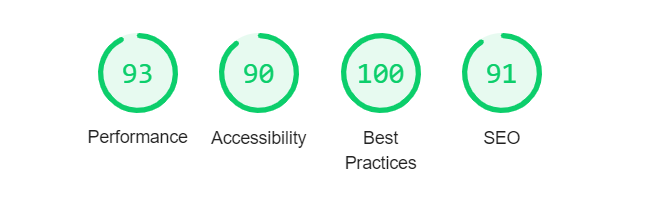
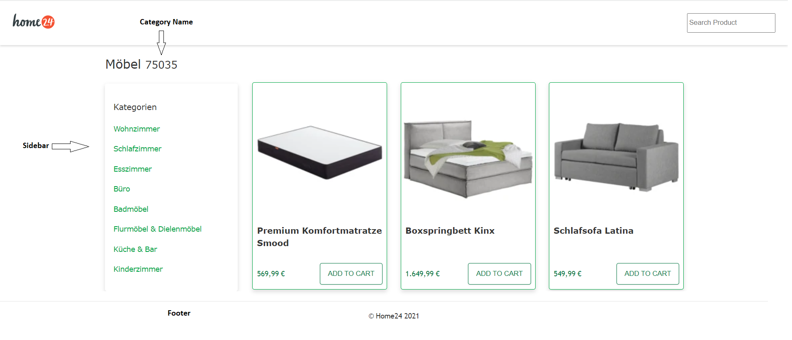
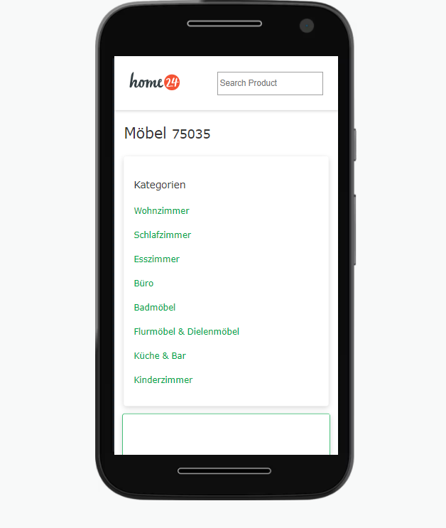
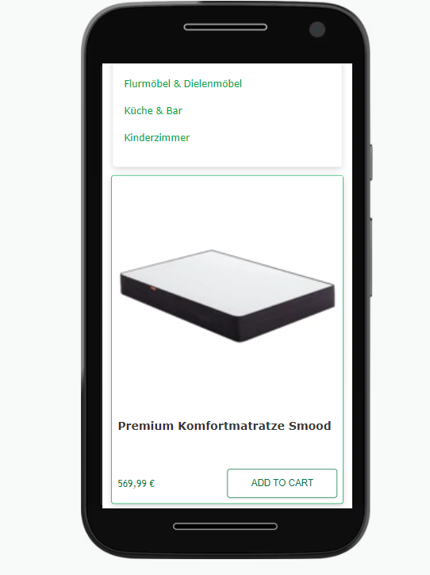

## Task to perform  [Problem statement reference](README.md)

  ### Used Technologies   

  * React
    - Functional Component
    - React-Hook 
    - HOC 
    - ContextAPI
  * TypeScript
  * Styled Component   
  * React-testing-library for unit testing 

  ### Folder Structure 
```
  📦client
  |____ 📂 src 
  |____ 📂 component > Contains all the styled component 
  |     |__ 📜 Box.tsx
  |     |__ 📜 Button.tsx
  |     |__  ... 
  |     |__ 📜 ThemeProvider.js > Styled Component provider
  |     |__ 📜 GlobalStyles.tsx > Styled component configuration
  |
  |____ 📂 context 
  |     |__ 📜 ProductContext.tsx 
  |
  |____ 📂 hooks 
  |     |__ 📜useFetchProducts.tsx > custom hook to fetch data 
  |
  |____ 📂 hoc 
  |     |__ 📜withLoader.tsx  
  |
  |____ 📂 layout > Page Layout components
  |     |___ 📜 Header.tsx 
  |     |___ 📜 Body.tsx 
  |     |___ 📜 Footer.tsx 
  |
  |____ 📂 modules 
  |     |__ 📂 product  
  |         |__ 📜 Header.tsx 
  |         |__ 📜 Body.tsx 
  |         |__ 📜 Footer.tsx 
  |
  |____ 📂 Pages 
  |     |__ 📜 PLP.tsx 
  |
  |____ 📂 utils 
  |     |__ 📜 formatter.ts 
  |
  |____ 📜 app.tsx 
  |____ 📜 setupTests.ts 
  
```     

## New Addition

### **Added Styled component**

I have introduced styled component as styling solution, I have created some granular UI component e.g.
  - List
  - Listitem 
  - Box 
  - Flex
  - Botton

Using them I had build the UI component to avoid additional styling.

### **HOC** - withLoader
To manage application loading state, I have created one HOC and it will manage loading or application UI state.

### **context API** - ProductContext
The purpose of using context API is centralize the data storage in Application and leverage it in different component.

### **Custom hook** - useFetchProduct
To separate the API logic from the component I had created customHook which is responsible to provide response and loading status to application and the response data is connected to context API(**ProductContext**) to serve to application.

### **Search Functionality**
I have enabled the search functionality to filter the product from in list. 

### **Introduce Accessibility**
In different part of application I had added a basic required accessibility so will be easy to read by DOM and screen reader.
I have used the html semantics tags to define the UI area to batter accessibility and define page structure.

e.g header, main, section, footer

- On tab user can access the all the actionable button/elements.
- focus tabIndex will be displayed as active.
- Added HTML5 semantics tags in Header and Footer components.
- Here is some performance and accessibility screenshots (Lighthouse Report)
<br/>


### **Responsive UI**
With help **styled component** and **styled bootstrap grid** I tried to create palette and theme

**Note** - For reference I followed blogs and used some define structure from there to create palette.

### **Unit Test cases**
Added unit test cased using **React-testing-library** and **jest** to validate the functionality and DOM.


## **UI screenshots**
  Now after so much technical, its time to see how UI looks like   

  ***Desktop View***



  ***Mobile View***




## Changes in package.json 

### Package install
- "@styled-system/prop-types": "^5.1.5" 
- "@types/styled-components": "^5.1.15" 
- "styled-bootstrap-grid": "^3.1.0",
- "styled-components": "^5.2.0",
- "styled-system": "^5.1.5",
- "@testing-library/react-hooks": "^7.0.2",
- "@types/styled-system": "^5.1.13",
- "@types/styled-system__css": "^5.0.16"

### Changes/Added scripts
 - "test": "react-scripts test --watchAll=false",
 - "test:update": "react-scripts test --watchAll=false -u",
 - "test:coverage": "react-scripts test --watchAll=false --coverage -u",

### jest mock config

```
"jest": {
        "resetMocks": false
    }
```


# At the end I would like to thank you for such a great learning exposure and this task. 
